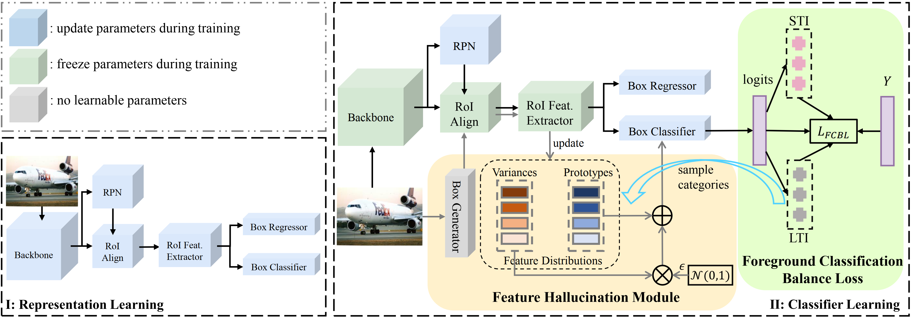

<div align=center>

# Balanced Classification: A Unified Framework for Long-Tailed Object Detection

</div>

<div align=center>

[](https://arxiv.org/abs/2308.02213)

</div>

This repo is the official implementation for paper: **Balanced Classification: A Unified Framework for Long-Tailed Object Detection** (Accepted by IEEE Transactions on Multimedia).

## News
**2023-08-03**: Our paper is accepted by IEEE Transactions on Multimedia (TMM) and to be published!

## Introduction

Conventional detectors suffer from performance degradation when dealing with long-tailed data due to a classification bias towards the majority head categories. In this paper, we contend that the learning bias originates from two factors: 1) the unequal competition arising from the imbalanced distribution of foreground categories, and 2) the lack of sample diversity in tail categories. To tackle these issues, we introduce a unified framework called **BA**lanced **CL**assification (**BACL**), which enables adaptive rectification of category distribution disparities and dynamic intensification of sample diversities in a synchronized manner. Specifically, a novel foreground classification balance loss (FCBL) is developed to ameliorate the domination of head categories and shift attention to difficult-to-differentiate categories by introducing pairwise class-aware margins and auto-adjusted weight terms, respectively. This loss prevents the over-suppression of tail categories by dominant head categories in the context of unequal competition. Moreover, we propose a dynamic feature hallucination module (FHM), which expands the representation of tail categories in the feature space by synthesizing hallucinated samples to introduce additional data variances. In this divide-and-conquer approach, BACL sets the new state-of-the-art on the challenging LVIS benchmark with a decoupled training pipeline, surpassing vanilla Faster R-CNN with ResNet-50-FPN by 5.8\% AP and 16.1\% AP for overall and tail categories. Extensive experiments demonstrate that BACL consistently achieves performance improvements across various datasets with different backbones and architectures.




## Requirements

### 1. Environment:
We tested on the following settings:

- python 3.8
- cuda 11.0
- pytorch 1.7.0
- torchvision 0.4.0
- [mmcv 1.2.7](https://github.com/open-mmlab/mmcv/tree/v1.2.7)

#### Use MMDetection by Docker

We provide a [Dockerfile](docker/Dockerfile) to build an image. Ensure that you are using [docker version](https://docs.docker.com/engine/install/) >=19.03。

```shell
# build an image with PyTorch 1.7.0, CUDA 11.0
# If you want to use another version, just modify the Dockerfile
docker build -t mmdetection docker/
```

Run it with:

```shell
docker run --gpus all --shm-size=8g -it -v {DATA_DIR}:/mmdetection/data mmdetection
```

### 2. Data:
#### a. For dataset images:

```shell=
# Make sure you are in dir BACL

mkdir data
cd data
mkdir lvis_v0.5
mkdir lvis_v1
```
    
- If you already have COCO2017 dataset, it will be great. Link `train2017` and `val2017` folders under folder `lvis_v0.5` and `lvis_v1`.
- If you do not have COCO2017 dataset, please download:
        [COCO train set](http://images.cocodataset.org/zips/train2017.zip) and 
        [COCO val set](http://images.cocodataset.org/zips/val2017.zip)
        and unzip these files and mv them under folder `lvis_v0.5` and `lvis_v1`.

#### b. For dataset annotations:
- Download lvis_v0.5 annotations:
        [lvis_v0.5_train_ann](https://s3-us-west-2.amazonaws.com/dl.fbaipublicfiles.com/LVIS/lvis_v0.5_train.json.zip) and
        [lvis_v0.5_val_ann](https://s3-us-west-2.amazonaws.com/dl.fbaipublicfiles.com/LVIS/lvis_v0.5_val.json.zip),
- Unzip all the files and put them under `lvis_v0.5/annotations`;

- Download lvis_v1 annotations:
        [lvis_v1_train_ann](https://s3-us-west-2.amazonaws.com/dl.fbaipublicfiles.com/LVIS/lvis_v1_train.json.zip) and
        [lvis_v1_val_ann](https://s3-us-west-2.amazonaws.com/dl.fbaipublicfiles.com/LVIS/lvis_v1_val.json.zip),
- Unzip all the files and put them under `lvis_v1/annotations`.

**After all these operations, the folder `data` should be like this:**
```
    data
    ├── lvis_v0.5
    │   ├── annotations
    │   │   ├── lvis_v0.5_train.json
    │   │   ├── lvis_v0.5_val.json
    │   ├── train2017
    │   │   ├── 000000100582.jpg
    │   │   ├── 000000102411.jpg
    │   │   ├── ......
    │   └── val2017
    │       ├── 000000062808.jpg
    │       ├── 000000119038.jpg
    │       ├── ......
    ├── lvis_v1
    │   ├── annotations
    │   │   ├── lvis_v1_train.json
    │   │   ├── lvis_v1_val.json
    │   ├── train2017
    │   │   ├── 000000100582.jpg
    │   │   ├── 000000102411.jpg
    │   │   ├── ......
    │   └── val2017
    │       ├── 000000062808.jpg
    │       ├── 000000119038.jpg
    │       ├── ......
```

## Training

Use the following commands to train a model for lvis_v0.5.

```train
# use decoupled training pipeline:

# 1. representation learning stage of BACL
./tools/dist_train.sh configs/bacl/bacl_representation_faster_rcnn_r50_fpn_1x_lvis_v0.5.py 8

# 2. classifier learning stage of BACL
./tools/dist_train.sh configs/bacl/bacl_classifier_faster_rcnn_r50_fpn_mstrain_1x_lvis_v0.5.py 8
```

Use the following commands to train a model for lvis_v1.

```train
# use decoupled training pipeline:

# 1. representation learning stage of BACL
./tools/dist_train.sh configs/bacl/bacl_representation_faster_rcnn_r50_fpn_1x_lvis_v1.py 8

# 2. classifier learning stage of BACL
./tools/dist_train.sh configs/bacl/bacl_classifier_faster_rcnn_r50_fpn_mstrain_1x_lvis_v1.py 8
```

> ***Important***: The default learning rate in config files is for 8 GPUs and 2 img/gpu (batch size = 8*2 = 16). According to the Linear Scaling Rule, you need to set the learning rate proportional to the batch size if you use different GPUs or images per GPU, e.g., lr=0.01 for 4 GPUs * 2 img/gpu and lr=0.08 for 16 GPUs * 4 img/gpu. (Cited from [mmdetection](https://github.com/open-mmlab/mmdetection/blob/v1.0rc0/GETTING_STARTED.md).)


## Testing

Use the following commands to test a trained model. 
```test
./tools/dist_test.sh \
 ${CONFIG_FILE} ${CHECKPOINT_FILE} ${GPU_NUM} [--out ${RESULT_FILE}] [--eval ${EVAL_METRICS}]
```

> - `$RESULT_FILE`: Filename of the output results in pickle format. If not specified, the results will not be saved to a file.
> - `$EVAL_METRICS`: Items to be evaluated on the results. `bbox` for bounding box evaluation only. `bbox segm` for bounding box and mask evaluation.

For example (assume that you have finished the training of **BACL** models.):
- To evaluate the trained **BACL** model with Faster R-CNN R50-FPN for object detection:
```eval
./tools/dist_test.sh configs/bacl/bacl_classifier_faster_rcnn_r50_fpn_mstrain_1x_lvis_v0.5.py \
./work_dirs/bacl_classifier_faster_rcnn_r50_fpn_mstrain_1x_lvis_v0.5/epoch_12.pth 8 \
--eval bbox
```


## Results and models

For your convenience, we provide the following trained models. All models are trained with 16 images in a mini-batch.

Method | Backbone | Dataset | box AP | Model
--- |:---:|:---:|:---:|:---:
baseline | R50_FPN              | LVIS v0.5 | 22.0 | [config](configs/bacl/faster_rcnn_r50_fpn_mstrain_2x_lvis_v0.5.py) / [model](https://drive.google.com/file/d/15NSUqm2udj-WTcf3zG50q2XLhVkKOuvI/view?usp=drive_link)
BACL | R50_FPN              | LVIS v0.5 | 27.8 | [config](configs/bacl/bacl_classifier_faster_rcnn_r50_fpn_mstrain_1x_lvis_v0.5.py) / [model](https://drive.google.com/file/d/1gLF5klXKD4coXvz6R6tTPJNTAn1FCf1m/view?usp=drive_link)
baseline | R50_FPN              | LVIS v1 | 19.3 | [config](configs/bacl/faster_rcnn_r50_fpn_mstrain_2x_lvis_v1.py) / [model](https://drive.google.com/file/d/1JHyXYlHCz-4qhroTKBfvZW5bjdhnvo9r/view?usp=drive_link)
BACL | R50_FPN              | LVIS v1 | 26.1 | [config](configs/bacl/bacl_classifier_faster_rcnn_r50_fpn_mstrain_1x_lvis_v1.py) / [model](https://drive.google.com/file/d/1XLPmszWrn6KxGsvIp0q6tcfPB_4ouRm3/view?usp=drive_link)
baseline | R101_FPN              | LVIS v0.5 | 23.3 | [config](configs/bacl/faster_rcnn_r101_fpn_mstrain_2x_lvis_v0.5.py) / [model](https://drive.google.com/file/d/1T3Hn5FCFaKXBtT53-_DovkSHknKjhjPm/view?usp=drive_link)
BACL | R101_FPN              | LVIS v0.5 | 29.4 | [config](configs/bacl/bacl_classifier_faster_rcnn_r101_fpn_mstrain_1x_lvis_v0.5.py) / [model](https://drive.google.com/file/d/12Zrv6Fswvdrc1sM1c4glfxi4kMbk65VC/view?usp=drive_link)
baseline | R101_FPN              | LVIS v1 | 20.9 | [config](configs/bacl/faster_rcnn_r101_fpn_mstrain_2x_lvis_v1.py) / [model](https://drive.google.com/file/d/1p6ojXvWij3BVfsGZNa8go5UE2l5qlJ4W/view?usp=drive_link)
BACL | R101_FPN              | LVIS v1 | 27.8 | [config](configs/bacl/bacl_classifier_faster_rcnn_r101_fpn_mstrain_1x_lvis_v1.py) / [model](https://drive.google.com/file/d/1gR5CyalFWegQnqC7Oa0BOn_P6rIu4_iy/view?usp=drive_link)

[0] *All results are obtained with a single model and without any test time data augmentation such as multi-scale, flipping and etc..* \
[1] *Refer to more details in config files in `config/bacl/`.*

## Citation
If you find it useful in your research, please consider citing our paper as follows:
```citation
@misc{qi2023balanced,
      title={Balanced Classification: A Unified Framework for Long-Tailed Object Detection}, 
      author={Tianhao Qi and Hongtao Xie and Pandeng Li and Jiannan Ge and Yongdong Zhang},
      year={2023},
      eprint={2308.02213},
      archivePrefix={arXiv},
      primaryClass={cs.CV}
}
```

## Credit
Thanks MMDetection team for the wonderful open source project!